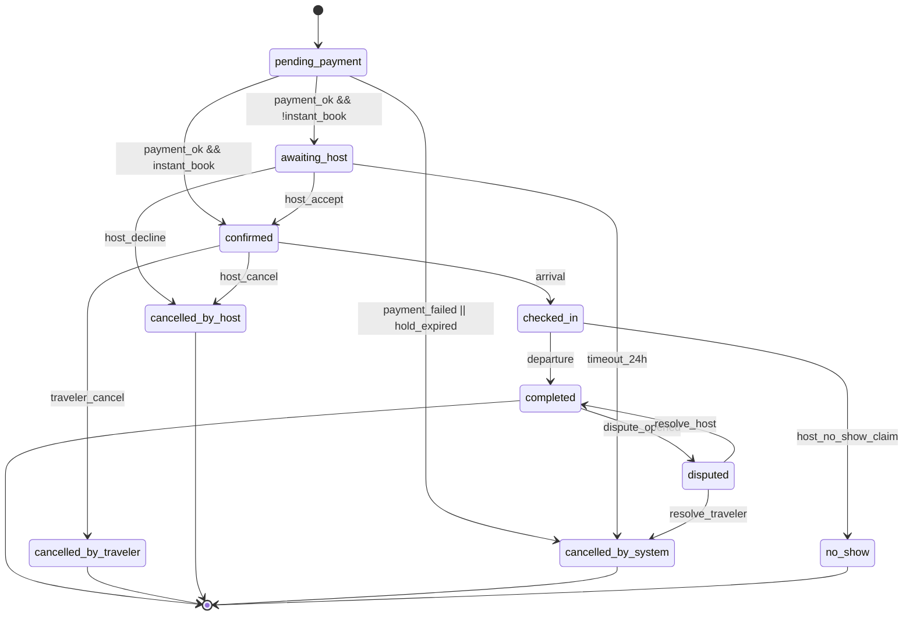
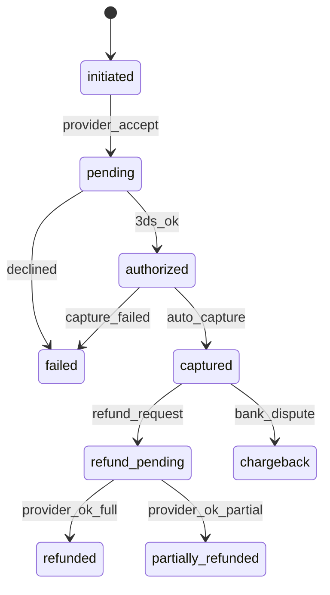
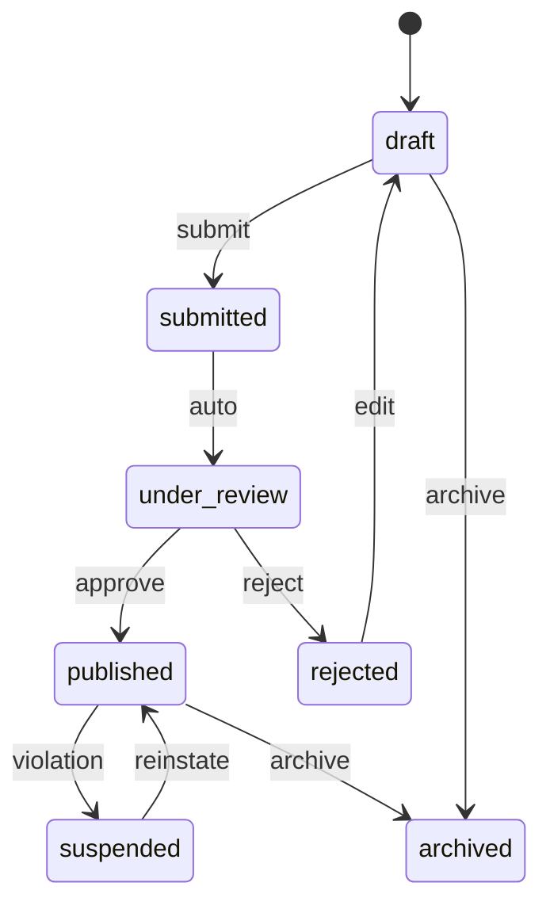
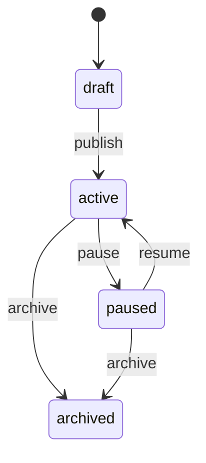
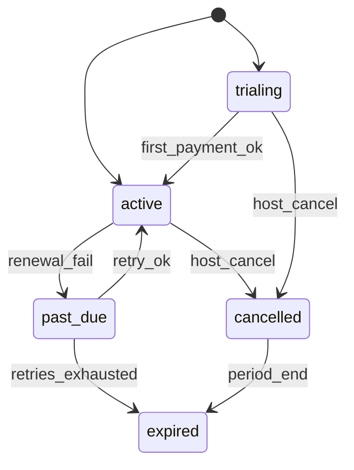
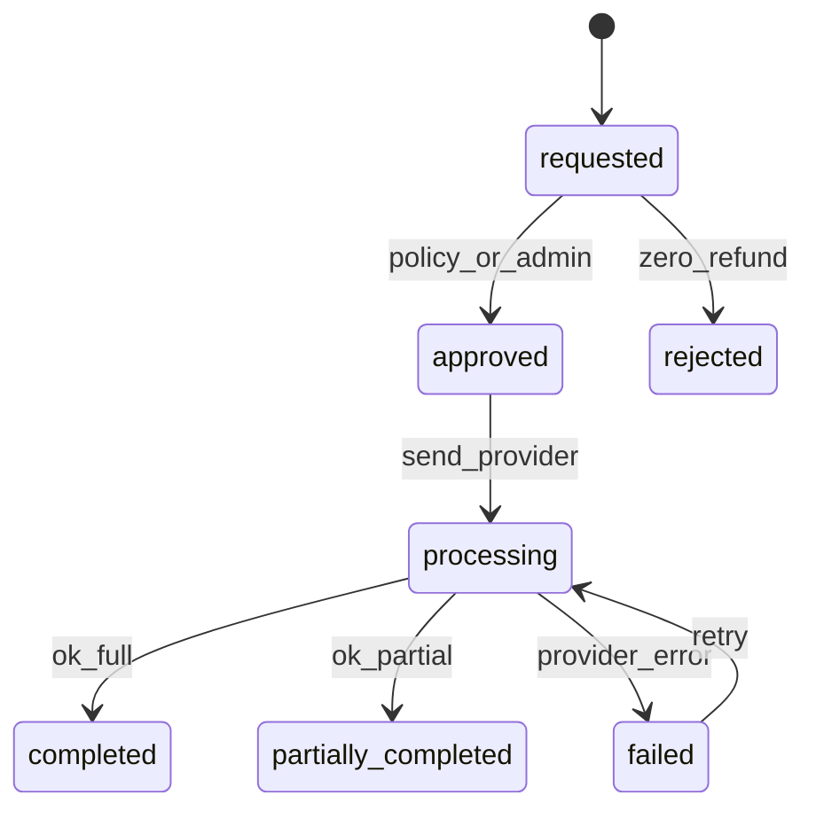
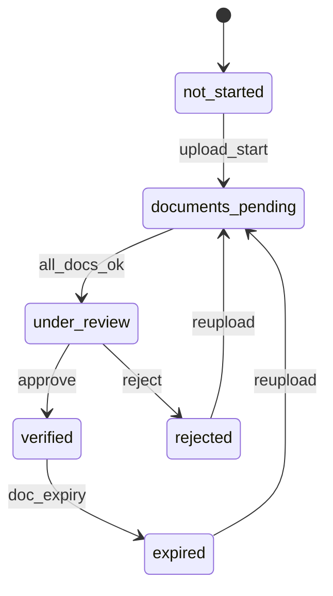
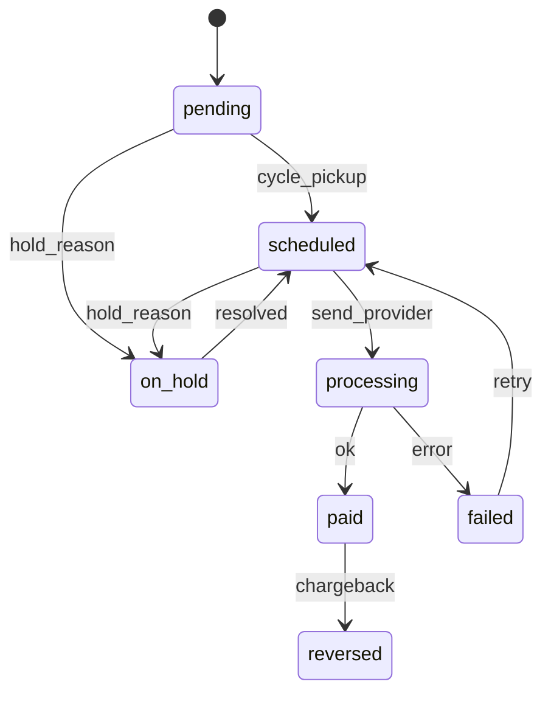
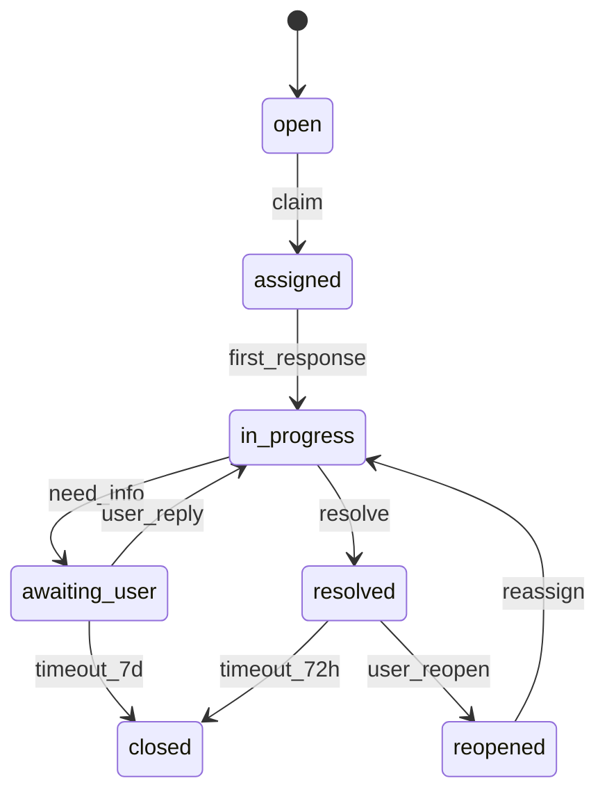
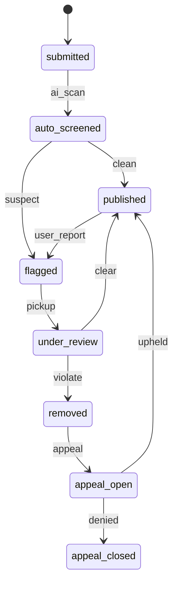

# StayBF — Revenue Model v2 & State Machines (Authoritative)

**Status:** FINAL — supersedes all earlier revenue numbers in
`StayBF_Architecture.md` and `StayBF_Business_Logic_Blueprint.md`.
**Replaces:** any mention of "12% commission" / "host commission 12%".
**Audience:** backend engineers about to write Supabase migrations,
finance, product, data.

All amounts are in **integer FCFA** (no cents). Rounding rule:
`Math.round()` to the nearest FCFA after each percentage calculation.
Sums are reconciled against `accommodation_amount` and never against
intermediate rounded values to avoid drift.

---

## 1. Corrected Revenue Model

### 1.1 Glossary

| Symbol | Meaning |
|---|---|
| `A` | Accommodation amount (sum of nightly rates × nights, plus per-stay add-ons such as cleaning fee, **excluding** taxes and platform fees) |
| `F_t` | Traveler service fee — **10% of A** |
| `C_h` | Host commission — **15% of A** if host has no active subscription, **0%** if subscription is active at booking confirmation time |
| `T`  | Traveler total charged at checkout |
| `H`  | Host net payout |
| `R`  | StayBF gross revenue per booking |

### 1.2 Traveler — always the same

```
T = A + F_t
F_t = round(A * 0.10)
```

The traveler is **never aware** of the host's subscription state. The
fee line on the receipt is always labelled "Frais de service StayBF
(10%)".

### 1.3 Host — depends on subscription state at booking **confirmation**

**Subscription snapshot rule:** the commission rate is frozen at the
moment a booking transitions to `confirmed`. Later subscription
cancellation does NOT retro-apply commission; later subscription
activation does NOT retro-waive commission. This is the single source of
truth used by payout, refund and analytics.

#### No active subscription (Free plan)

```
C_h = round(A * 0.15)
H   = A - C_h
R   = F_t + C_h          // 10% traveler + 15% host = 25% of A
```

#### Active subscription (Monthly / Annual / Premium)

```
C_h = 0
H   = A
R   = F_t                // 10% of A only
```

### 1.4 Worked examples

Booking of `A = 100 000 FCFA`:

| Host plan | Traveler pays `T` | Host receives `H` | StayBF earns `R` |
|---|---|---|---|
| Free | 110 000 | 85 000 | 25 000 |
| Monthly (15 000/mo) | 110 000 | 100 000 | 10 000 |
| Annual (120 000/yr) | 110 000 | 100 000 | 10 000 |
| Premium (25 000/mo) | 110 000 | 100 000 | 10 000 |

Booking of `A = 47 500 FCFA`, host on Free:
- `F_t = round(47500*0.10) = 4750`
- `C_h = round(47500*0.15) = 7125`
- `T = 52250`, `H = 40375`, `R = 11875`.

### 1.5 Subscription Plans (authoritative table)

| Plan code | Label | Price | Billing | Commission | Perks |
|---|---|---|---|---|---|
| `free` | Découverte | 0 FCFA | n/a | **15%** | Listing, base visibility |
| `monthly` | Croissance | 15 000 FCFA | every 1 month | **0%** | All Free + zero commission |
| `annual` | Croissance Annuel | 120 000 FCFA | every 12 months | **0%** | 12-month commitment, equivalent to 10 000/mo |
| `premium` | Premium | 25 000 FCFA | every 1 month | **0%** | Priority placement in search, "Recommandé" badge, featured slots, advanced analytics |

> Annual plan is **a separate SKU**, not a discount on Monthly. Switching
> Monthly → Annual is a plan change effective at next renewal unless the
> host explicitly prorates and pays the difference upfront.

---

## 2. Updated Workflows

Only the deltas vs. the Business Logic Blueprint are listed. Everything
else in the Blueprint remains valid.

### 2.1 Revenue Distribution (per booking)

Trigger: booking enters `completed` (24h after `checked_in` or at
checkout time, whichever first).

```
A   = booking.accommodation_amount
F_t = booking.service_fee_amount        // stored at confirmation
C_h = booking.commission_amount         // stored at confirmation
H   = A - C_h
R   = F_t + C_h
```

Ledger entries written atomically (`ops.ledger`):

| Entry | Debit | Credit | Amount |
|---|---|---|---|
| Traveler charge | `cash:cinetpay` | `liability:bookings_held` | `T` |
| Service fee recognition | `liability:bookings_held` | `revenue:service_fee` | `F_t` |
| Commission recognition | `liability:bookings_held` | `revenue:commission` | `C_h` |
| Host payable | `liability:bookings_held` | `liability:host_payouts` | `H` |

`sum(credits) = sum(debits) = T` — invariant enforced by a DB trigger.

### 2.2 Host Subscription Workflow (delta)

- On `subscription.activated` while host has bookings in
  `pending_payment` or `awaiting_host`, **recompute** `C_h = 0` for
  those not-yet-confirmed bookings only. Already-confirmed bookings
  keep their frozen rate (1.3).
- Free → Paid transition has no proration of past bookings.
- Paid → Free at expiration (3.x) re-enables 15% commission for
  **future** bookings.

### 2.3 Subscription Expiration

Run nightly at `00:30 Africa/Ouagadougou`:

1. `subscription.current_period_end < now` ⇒ status = `past_due`,
   dunning starts (3 retries: +0h, +48h, +120h).
2. `past_due` AND last retry failed ⇒ status = `expired`, plan reverts
   to `free`. Notification: "Votre abonnement a expiré, la commission
   de 15% s'applique aux nouvelles réservations."
3. Premium-only perks (priority placement, badge) are revoked
   immediately on `expired`.

### 2.4 Payout Calculation

Per payout cycle (T+1 for verified hosts, T+5 otherwise):

```
payout_amount = SUM(
  booking.accommodation_amount - booking.commission_amount
) WHERE booking.status = 'completed'
  AND booking.payout_status = 'pending'
  AND booking.host_id = :host
```

Minimum payout threshold: **10 000 FCFA**. Below threshold rolls over.

### 2.5 Analytics — Host Dashboard

Replace any metric using `0.12`:

- `gross_bookings = SUM(A)`
- `commission_paid = SUM(C_h)`  // 0 when subscribed
- `net_revenue    = gross_bookings - commission_paid`
- `effective_take_rate = commission_paid / gross_bookings`
  (Free hosts: 15%, Subscribed: 0%)

### 2.6 Analytics — Admin Dashboard

- `platform_revenue = SUM(F_t) + SUM(C_h)`
- `subscription_mrr = active_monthly_count * 15000
                    + active_premium_count * 25000
                    + active_annual_count  * 10000  // 120k / 12`
- `arpu_host = platform_revenue / active_hosts`
- `commission_share = SUM(C_h) / platform_revenue`
- `fee_share        = SUM(F_t) / platform_revenue`

### 2.7 ERD / Schema notes

`bookings`:
- `accommodation_amount         int  not null`
- `service_fee_rate             numeric(5,4) not null default 0.10`
- `service_fee_amount           int  not null`
- `commission_rate              numeric(5,4) not null` -- 0.15 or 0.00
- `commission_amount            int  not null`
- `total_amount                 int  not null` -- = A + F_t
- `host_payout_amount           int  not null` -- = A - C_h
- `host_subscription_snapshot   jsonb not null` -- plan_code, period_end
- `payout_status enum('pending','scheduled','paid','on_hold','reversed')`

`subscription_plans` seed rows must match §1.5 exactly. Any code path
referencing `0.12` is a bug.

---

## 3. State Machines (×10)

Format per entity: Purpose · States · Transitions table · Invalid
transitions · Triggers · Permissions · Business rules · Failure &
recovery. Mermaid diagrams included.

### 3.1 Booking

**Purpose:** Lifecycle of a traveler reservation.
**States:** `pending_payment`, `awaiting_host`, `confirmed`,
`checked_in`, `completed`, `cancelled_by_traveler`,
`cancelled_by_host`, `cancelled_by_system`, `no_show`, `disputed`.

| From → To | Trigger | Who | Entry conditions | Notifications | DB impact |
|---|---|---|---|---|---|
| `*` → `pending_payment` | Traveler submits booking | Traveler | Availability lock acquired | — | Insert booking, hold inventory 15 min |
| `pending_payment` → `awaiting_host` | Payment captured (Request-to-Book) | System (webhook) | CinetPay `00` | Push host, email traveler | Funds held |
| `pending_payment` → `confirmed` | Payment captured (Instant Book) | System | Property `instant_book = true` | Both parties | Freeze fees + commission snapshot |
| `awaiting_host` → `confirmed` | Host accepts within 24h | Host | Slot still free | Both parties | Same as above |
| `awaiting_host` → `cancelled_by_host` | Host declines | Host | — | Traveler, refund 100% | Reverse hold |
| `awaiting_host` → `cancelled_by_system` | 24h elapsed | Cron | — | Both | Refund 100% |
| `confirmed` → `checked_in` | Host marks arrival OR check-in date reached + auto rule | Host / System | `today >= start_date` | Traveler | Start stay |
| `checked_in` → `completed` | Host marks departure OR 24h after end_date | Host / System | `today >= end_date` | Both, prompt review | Trigger payout |
| `checked_in` → `no_show` | Host declares within 24h after start | Host | Evidence required | Both, dispute window opens | Hold payout |
| `confirmed` → `cancelled_by_traveler` | Traveler cancels | Traveler | Cancellation window open | Both | Apply policy refund |
| `confirmed` → `cancelled_by_host` | Host cancels | Host | Penalty applies | Both, admin | 100% refund + host strike |
| `completed` → `disputed` | Traveler or host opens dispute ≤72h | Either | Within SLA | Support team | Freeze payout |
| `disputed` → `completed` | Resolved in favor of host | Admin | — | Both | Release payout |
| `disputed` → `cancelled_by_system` | Resolved in favor of traveler | Admin | — | Both | Refund (partial/full) |

**Invalid:** `completed` → anything except `disputed`; any cancelled
state → anything; `pending_payment` → `checked_in`; backwards moves
generally forbidden.

**Rules:**
- Commission/fee snapshot frozen on entry to `confirmed`.
- `no_show` releases 100% to host minus 10% traveler fee, unless dispute.
- `cancelled_by_host` adds a strike; 3 strikes/12mo → host review.

**Failure & recovery:** webhook duplicate → idempotency key on
`provider_event_id`; payment captured but DB write failed → reconciler
retries; expired hold + late capture → auto-refund.



### 3.2 Payment

**States:** `initiated`, `pending`, `authorized`, `captured`, `failed`,
`refund_pending`, `refunded`, `partially_refunded`, `chargeback`.

| From → To | Trigger | Who |
|---|---|---|
| `*` → `initiated` | Checkout starts | Traveler |
| `initiated` → `pending` | Provider accepts | System |
| `pending` → `authorized` | 3DS / OTP ok | Provider |
| `authorized` → `captured` | Auto-capture on booking confirm | System |
| `pending`/`authorized` → `failed` | Provider declines / timeout 15min | System |
| `captured` → `refund_pending` | Cancellation / dispute resolution | System/Admin |
| `refund_pending` → `refunded` | Provider confirms | Provider |
| `refund_pending` → `partially_refunded` | Provider confirms partial | Provider |
| `captured` → `chargeback` | Bank dispute received | Provider |

**Invalid:** `failed` → `captured`; `refunded` → `captured`; skipping
`authorized` for card flows.

**Rules:** Idempotency on `(provider, provider_ref)`. Webhook signature
mandatory. `chargeback` always freezes related booking payout.



### 3.3 Property

**States:** `draft`, `submitted`, `under_review`, `published`,
`rejected`, `suspended`, `archived`.

| From → To | Trigger | Who |
|---|---|---|
| `[*]` → `draft` | Host creates | Host |
| `draft` → `submitted` | Host submits | Host |
| `submitted` → `under_review` | Auto on submit | System |
| `under_review` → `published` | Admin approve | Admin |
| `under_review` → `rejected` | Admin reject | Admin |
| `rejected` → `draft` | Host edits | Host |
| `published` → `suspended` | Admin / fraud rule | Admin/System |
| `suspended` → `published` | Admin reinstate | Admin |
| `*` → `archived` | Host archives (not while bookings active) | Host |

**Rules:** publish requires ≥3 photos, address + GPS, at least one
bookable room, cancellation policy, price > 0.
**Invalid:** `archived` → anything; `published` ⇄ `draft` directly.



### 3.4 Room

**States:** `draft`, `active`, `paused`, `archived`.

| From → To | Trigger | Who |
|---|---|---|
| `[*]` → `draft` | Host creates | Host |
| `draft` → `active` | Host publishes (parent property `published`) | Host |
| `active` → `paused` | Host toggles off OR system seasonal block | Host/System |
| `paused` → `active` | Host re-enables | Host |
| `active`/`paused` → `archived` | Host removes (no future bookings) | Host |

**Rules:** `active` requires capacity ≥ 1, base price > 0, ≥1 photo.
Archiving with active bookings ⇒ blocked, error
`ROOM_HAS_ACTIVE_BOOKINGS`.



### 3.5 Subscription

**States:** `trialing`, `active`, `past_due`, `cancelled`, `expired`.

| From → To | Trigger | Who |
|---|---|---|
| `[*]` → `trialing` | Host starts trial (optional, 14d) | Host |
| `trialing` → `active` | First successful payment | System |
| `[*]` → `active` | Direct subscribe + payment ok | Host/System |
| `active` → `past_due` | Renewal failed | System |
| `past_due` → `active` | Retry succeeded | System |
| `past_due` → `expired` | All 3 retries failed | System |
| `active`/`trialing` → `cancelled` | Host cancels (effective at period end) | Host |
| `cancelled` → `expired` | period_end reached | System |

**Rules:** plan change Monthly→Annual = new subscription record;
`expired` reverts host to Free; commission rate of new bookings recomputed
immediately.



### 3.6 Refund

**States:** `requested`, `approved`, `processing`, `completed`,
`partially_completed`, `rejected`, `failed`.

| From → To | Trigger | Who |
|---|---|---|
| `[*]` → `requested` | Cancellation or dispute resolution | System/Admin |
| `requested` → `approved` | Auto by policy OR admin OK | System/Admin |
| `requested` → `rejected` | Policy says 0% & no override | System/Admin |
| `approved` → `processing` | Sent to provider | System |
| `processing` → `completed` | Provider OK (full) | Provider |
| `processing` → `partially_completed` | Provider OK (partial) | Provider |
| `processing` → `failed` | Provider error | Provider |
| `failed` → `processing` | Retry (max 3) | System |

**Rules:** refunds >500 000 FCFA require dual-admin approval.
Refund never exceeds `payment.captured_amount`.



### 3.7 Host Verification (KYC)

**States:** `not_started`, `documents_pending`, `under_review`,
`verified`, `rejected`, `expired`.

| From → To | Trigger | Who |
|---|---|---|
| `not_started` → `documents_pending` | Host uploads ID/selfie | Host |
| `documents_pending` → `under_review` | All required docs uploaded | System |
| `under_review` → `verified` | Admin approves | Admin |
| `under_review` → `rejected` | Admin rejects with reason | Admin |
| `rejected` → `documents_pending` | Host re-uploads | Host |
| `verified` → `expired` | Doc expiry date reached | System |
| `expired` → `documents_pending` | Host re-uploads | Host |

**Rules:** unverified host cannot receive payouts > 100 000 FCFA total
pending. `verified` is a prereq for Premium plan.



### 3.8 Host Payout

**States:** `pending`, `scheduled`, `processing`, `paid`, `on_hold`,
`reversed`, `failed`.

| From → To | Trigger | Who |
|---|---|---|
| `[*]` → `pending` | Booking `completed` | System |
| `pending` → `scheduled` | Payout cycle picks it up (≥10 000 FCFA, T+1/T+5) | System |
| `pending`/`scheduled` → `on_hold` | Dispute, KYC issue, fraud flag | System/Admin |
| `on_hold` → `scheduled` | Issue resolved | Admin |
| `scheduled` → `processing` | Sent to Mobile Money | System |
| `processing` → `paid` | Provider OK | Provider |
| `processing` → `failed` | Provider error | Provider |
| `failed` → `scheduled` | Retry (max 3, then manual) | System |
| `paid` → `reversed` | Chargeback / fraud confirmed | Admin |



### 3.9 Support Ticket

**States:** `open`, `assigned`, `awaiting_user`, `in_progress`,
`resolved`, `closed`, `reopened`.

| From → To | Trigger | Who |
|---|---|---|
| `[*]` → `open` | User submits | User |
| `open` → `assigned` | Router/agent claim | System/Agent |
| `assigned` → `in_progress` | Agent first response | Agent |
| `in_progress` → `awaiting_user` | Agent needs info | Agent |
| `awaiting_user` → `in_progress` | User replies | User |
| `awaiting_user` → `closed` | 7d no reply | System |
| `in_progress` → `resolved` | Agent resolves | Agent |
| `resolved` → `closed` | 72h no reopen | System |
| `resolved` → `reopened` | User reopens ≤72h | User |
| `reopened` → `in_progress` | Re-assigned | System |

SLA: first response ≤2h (P1), ≤8h (P2), ≤24h (P3).



### 3.10 Review Moderation

**States:** `submitted`, `auto_screened`, `published`, `flagged`,
`under_review`, `removed`, `appeal_open`, `appeal_closed`.

| From → To | Trigger | Who |
|---|---|---|
| `[*]` → `submitted` | Author posts after stay window | Traveler/Host |
| `submitted` → `auto_screened` | AI/profanity check | System |
| `auto_screened` → `published` | Clean | System |
| `auto_screened` → `flagged` | Suspect terms | System |
| `published` → `flagged` | User report | User |
| `flagged` → `under_review` | Moderator picks up | Moderator |
| `under_review` → `published` | Cleared | Moderator |
| `under_review` → `removed` | Violates policy | Moderator |
| `removed` → `appeal_open` | Author appeals ≤14d | Author |
| `appeal_open` → `published` | Appeal upheld | Senior Admin |
| `appeal_open` → `appeal_closed` | Appeal denied | Senior Admin |

**Rules:** double-blind reveal — reviews hidden until both sides
submit or 14-day window closes. Removed reviews never recompute
historical ratings older than 90 days.



---

## 4. Developer Notes (pre-migration checklist)

1. **Constants module** `src/lib/billing/constants.ts`:
   ```ts
   export const TRAVELER_FEE_RATE = 0.10;
   export const HOST_COMMISSION_FREE = 0.15;
   export const HOST_COMMISSION_SUBSCRIBED = 0.00;
   export const PAYOUT_MIN_FCFA = 10_000;
   export const PLANS = {
     free:    { price: 0,      commission: 0.15, period: null },
     monthly: { price: 15_000, commission: 0.00, period: '1 month' },
     annual:  { price: 120_000,commission: 0.00, period: '12 months' },
     premium: { price: 25_000, commission: 0.00, period: '1 month', perks: ['priority','badge'] },
   } as const;
   ```
2. **DB invariants** (CHECK constraints):
   - `service_fee_rate = 0.10`
   - `commission_rate IN (0.00, 0.15)`
   - `total_amount   = accommodation_amount + service_fee_amount`
   - `host_payout_amount = accommodation_amount - commission_amount`
3. **Seed** `subscription_plans` exactly as §1.5; migration that creates
   the table must include the seed in the same transaction.
4. **Search/replace** any literal `0.12`, `12%`, `commission = 12` in
   the codebase, mock data (`staybf-host-data.ts`,
   `staybf-admin-data.ts`), and prior docs.
5. **Frozen snapshot column** `host_subscription_snapshot jsonb` on
   `bookings` — written at transition to `confirmed`, never updated.
6. **Idempotency** keys on every webhook table
   (`payments_events`, `payouts_events`, `subscriptions_events`).
7. **Reconciliation cron** nightly: ledger sum per booking must equal
   `T`; mismatches open a P1 ticket automatically.

This document is the single authoritative source for revenue and state
transitions going into the migration phase.
